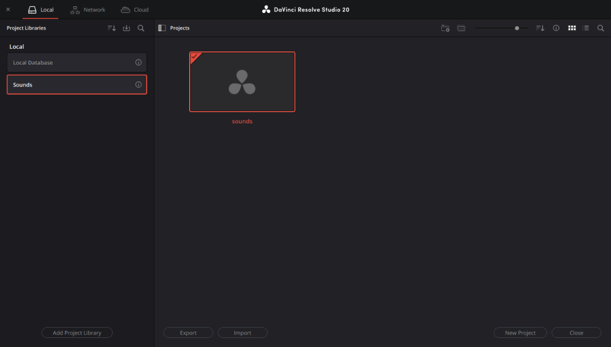
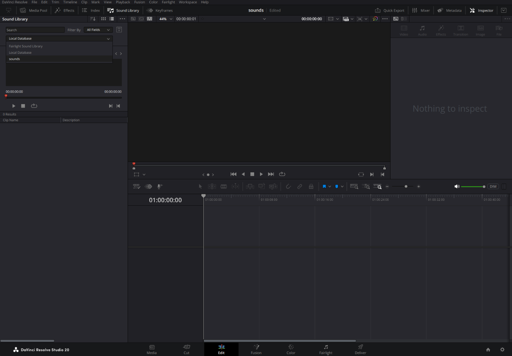
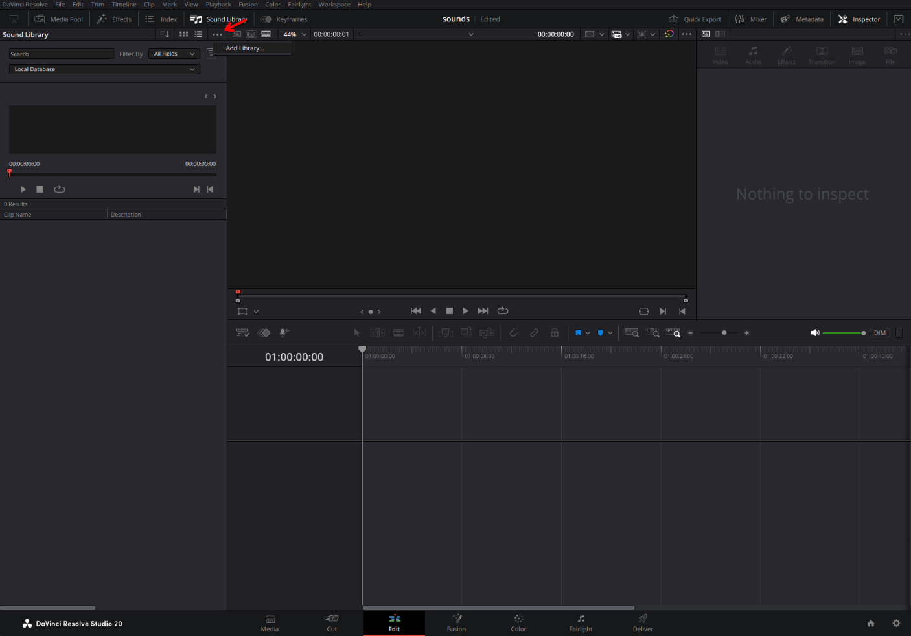

# BBC Sound Ripper

This project aims to download (most) sounds from the [BBC sound effects website](https://sound-effects.bbcrewind.co.uk/search)


[20251121_170612_demo_out2.webm](assets/20251121_170612_demo_out2.webm)

Due to limitations on how the website works, this project cant download every sound, but it gets pretty close at it. As of writing this, it is able to download 32,281 out of the 33,066 sounds on the website. For information on why that is, feel free to read my rant in the `README_but_for_nerds.md` file.

## How to get the files

You can run this script yourself. On a good internet connection, it takes about 10 minutes to download all the mp3 versions, with the wav versions taking MUCH longer (its about 617GiB, vs the 56.4GiB of mp3 files). If you don't have 600GiB of disk space, there is also an option to convert the files to flac as they download, which just about halfs the wav file sizes.

I will also be adding torrents of the files at a later date, which will be easier (and probably quicker) than running this script. It also helps the BBC by not using all their bandwidth!

## How to use this script

Download the repo and install the python dependencies. I recommend making a virtualenv in order to keep your system python install clean.

```bash
git clone <repo>
cd bbc_sound_ripper
python -m venv _venv
source ./_venv/bin/activate
pip install -r requirements.txt 
```

Once the requirements are installed, you can run the script with `python download.py`. The script is interactive and will ask a series of questions about which catagories of sounds you want to download, and in what format. No it doesn't take command line arguments... A lot of the options are fetched at runtime from querying the BBC sound effects API, and I didn't want you to have to wait for those API calls to be made to show help docs or populate the valid choices. You shouldn't be running this on a cron anyway, so yeah - thats the way it is.

When downloading files, its normal for the script to "slow down" towards the end. This is because the downloading process is multithreadded, so it appears to go fast when all the threads are running, but towards the end, theres less files to download then there are threads in the thread pool. Just be patient!

## Building a Davinci Resolve sound library

Since you are downloading a bunch of foley sounds, you _probably_ want to use these sounds in a video editing software. I use davinci resolve, so thats where my attention was focused. If you use another editor, cool, but your going to have to figure out the steps for yourself. The script embeds metadata into the files, so if your editor can pull from that, your in luck! if your editor doesnt, you will probably need to modify the script. The `buildFileInfo(..)` function shows you how I pull the metadata from the API results, so that would be a good starting point after you reverse how your editor stores the metadata.

1) Open Davinci Resolve. While you are on the "pick your project" screen, click the little menu button at the top left next to "Projects". (its just below the top bar with "Local", "Network", "Cloud")

   
2) Click "Add Project Library" at the bottom of the new side bar. Remember the file location that you chose! I personally used `~/Documents/Blackmagic Project Libraries` and named the project library "sounds"
3) Go ahead and open the default "Untitled Project" that appears. We will later save the project, which is why mine is already called "sounds" in the above screenshot.
4) Go to the "Edit" page, and then click on "Sound Library" in the top bar
5) Next, change the local database dropdown to be the project library you created earlier

   
6) After, click the 3 dots at the top of the sound library expando menu

   
7) Now click "add library", and choose the folder that you selected in the download.py script. In my case, this is `~/Music/BBC Sound Library` - This will take a good bit of time, so go make yourself a cup of coffee (or tea, if you are a member of the BBC reading this)
8) You can verify that the sounds were added by typing `***` into the search bar
9) Locate the file path for "SoundLib.db" - This should be inside the path you chose when creating the new project library from step 2. I did tell you to remember that path! In my case, its `~/Documents/Blackmagic Project Libraries/Resolve Projects/SoundLib.db`
10) CLOSE DAVINCI RESOLVE! (idk if this is necisary, but its written in caps, so you should do it anyway) (also, its ok if you moved the files after they downloaded, the script doesn't care about the files on disk at this point)
11) Take that path, and enter it in the script.
12) The script will now search through the Davinci Resolve sould library database that was populated in step 7, and manually add the description field.

The Davinci Resolve manual does not mention how to add this data manually, and a very old post on the forums mentions it pulls the info from the audio file its self. Audio metadata is a whole can of worms, so my guess is that the feature broke at some point, and no one raised a stink about it... so here we are, manually modifying the sqlite db. oh well, at least it works

you should now be able to type in tags in the audio library search bar, and it should look through the descriptions of the files (which actually contain the tags)!
